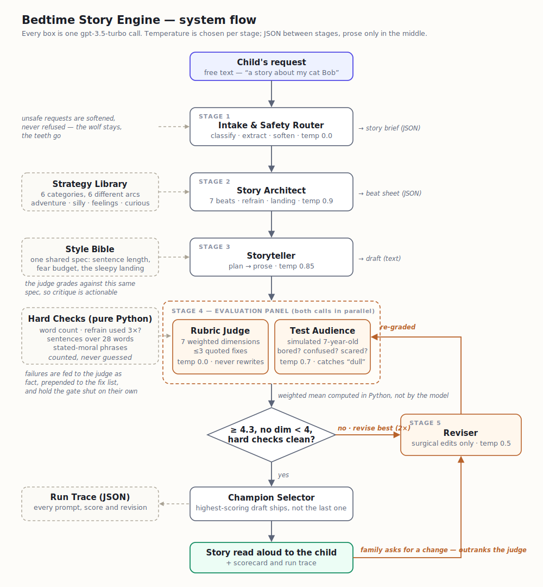

# Bedtime Story Engine

Tells bedtime stories for ages 5–10 using `gpt-3.5-turbo` (unchanged, as the
assignment requires).

One prompt gets you a competent, forgettable story. This is a small pipeline
with a router, planner, storyteller, judge, simulated child listener, and
reviser that gets you one worth reading out loud.



<sub>Vector version: [docs/block_diagram.svg](docs/block_diagram.svg)</sub>

---

## Run it

```bash
pip install -r requirements.txt
export OPENAI_API_KEY=sk-...           # or copy .env.example to .env

python main.py
python main.py --request "a story about a shy dragon who bakes bread"
python main.py --request "..." --quiet   # just the story, no diagnostics
python main.py --request "..." --save    # writes the full trace to runs/
python smoke_test.py                     # 40 tests, no API key needed
```

One story is 6–9 model calls, about 25 seconds, roughly a cent.

---

## The idea

gpt-3.5-turbo is a weak **writer** but a decent **executor**. Ask it to invent a
story and write it at the same time and both jobs come out badly. So the design
gives it as little to invent at once as possible: cheap structured calls surround
one prose call, and nothing ships without being graded.

```text
your request
   ↓
1. Route      What kind of story is this? Softens anything unsuitable.
   ↓
2. Plan       Seven story beats, each with a detail and a line of dialogue.
   ↓
3. Write      The only call that writes prose. Works from the plan.
   ↓
4. Measure    Python counts words, refrain repeats, sentence length, and
              checks for stated morals and repeated paragraphs.
   ↓
5. Grade      A judge scores seven dimensions. A simulated 7-year-old says
              whether she got bored, confused or scared. Both run at once.
   ↓
6. Gate       Good enough? If not, revise and grade again. Up to twice.
   ↓
7. Ship       The best-scoring draft, not the last one.
```

Afterwards the family can ask for changes, which re-enter at step 6 with
priority over the judge.

---

## Six decisions worth explaining

**Six kinds of story, six different shapes.** A silly story and a lullaby aren't
the same story with a different adjective. Each category has its own seven-beat
arc and its own rule. The funny arc escalates in threes and then drains the
energy before the end, because a story that peaks late leaves a child bouncing.

**One shared spec.** The style rules, including sentence length, what counts as
too scary, and how the last hundred words must slow down, go to the writer, the
judge *and* the reviser. A judge grading against a spec the writer never saw
produces criticism nobody can act on.

**Count in code, judge with the model.** Anything countable is measured in
Python and handed to the judge as fact. The judge used to be asked for these
numbers and got them wrong most of the time, reporting three refrains in a
draft that used two.

**Rules that depend on a measurement live in code.** I first wrote "if the draft
is too short, cap the arc score" as a judge instruction. It was given a 308-word
draft against a 600-word target, with the measurement in its prompt, and awarded
5s anyway. The rule was fine. Putting it somewhere it could be ignored was not.
It's now `apply_ceilings()` in `checks.py`.

**Two evaluators, because they fail differently.** The judge scores a rubric and
is forbidden from rewriting. A judge that rewrites becomes a second author and
you lose the measurement. Beside it sits Maya, age 7, who reports whether she got
bored. A rubric will happily give 4/5 to a story no child would sit through.

**The best draft ships, and the next revision starts from it.** Fixing one
problem can flatten another. Every draft is kept and scored. Revising from the
best rather than the latest matters too, or one bad revision poisons every round
after it. `smoke_test.py` tests that case specifically.

---

## What five rounds of real runs changed

I ran the same eight requests five times, reading the stories each round and
fixing what the output showed me.

|                                            | first run        | last run    |
| ------------------------------------------ | ---------------- | ----------- |
| length vs target                           | 27%              | 52%         |
| beat labels leaking into the prose         | 6 of 8           | 0 of 8      |
| refrain used an acceptable number of times | 0 of 8           | 6 of 8      |
| stories shipping with no defect            | —                | 6 of 8      |
| score spread                               | every story 4.90 | 4.15 – 4.90 |

Three of those are worth explaining, because the fix wasn't the obvious one.

**Enforcing length made the stories worse.** When word count was a hard gate, the
reviser satisfied it by bolting extra scenes onto the ending. One story came back
at 688 words with three endings and was plainly worse than the 382-word version
of itself. Length is now a guide with a wide tolerance. Only a genuinely
malformed length counts as a defect. Optimising the proxy cost the goal.

**The writer kept leaking the scaffolding.** It was writing "a ridiculous problem
arose" and "as the sleepy landing comes", my own beat labels used as topic
sentences. Banning it in the prompt helped a little. Not showing the writer the
labels at all fixed it outright. It can't leak what it never sees.

**Counting the refrain wasn't enough.** Told to add two more, the reviser twice
satisfied the count by stacking three identical lines at the end of the story.
The right number in the wrong place is worse than being one short, so the check
now looks at placement as well as count. That is the second time in this project
that optimising a number defeated the reason for the number.

---

## Limitations

**Factual accuracy isn't guaranteed.** The curious world category makes real
claims, and the model got the same question wrong in three separate runs. The
sea is salty because creatures cried into it, then because of a secret cave. The
planner now has to state the true explanation and the writer can't invent an
alternative, which helps but doesn't guarantee. A fact-check stage against a
source is the real fix, and it isn't in here.

**Originality is the weak dimension.** `spark` sat around 3.0 in every round
while everything else improved. That's this model's honest ceiling on this task:
competent, familiar prose. No prompt I tried moved it, and tuning the rubric
until it looked better would have been dishonest.

**The judge isn't validated.** It's a confident opinion until someone checks it
against human judgement. Hand-labelling ~30 stories and measuring agreement is
the first item on the what I'd build next list in `main.py`.

**Stories run short**, roughly half the target length. See above for why I
stopped fighting it.

---

## The files

Each file starts with a header saying what it is and what to read next.

| # | File            | What it does                                            |
| - | --------------- | ------------------------------------------------------- |
| 1 | `prompts.py`    | Every word sent to the model, and the six story types   |
| 2 | `pipeline.py`   | The pipeline: what runs, in what order, when to loop    |
| 3 | `checks.py`     | Plain Python measurement. No model, no other imports    |
| 4 | `llm.py`        | Talking to OpenAI: retries, broken-JSON repair, tracing |
| 5 | `main.py`       | The command line                                        |
| — | `smoke_test.py` | 40 tests against a stubbed model                        |
| — | `eval.py`       | This pipeline vs a single prompt, same judge            |

**In five minutes:** read `READ_ALOUD_STYLE` in `prompts.py`, then
`StoryEngine.tell()` in `pipeline.py`. That's the whole idea.

More: [architecture](docs/architecture.md) · [code map](docs/code_map.md)

---

## Notes

**Same model, current SDK.** `gpt-3.5-turbo` is untouched. The skeleton used
`openai.ChatCompletion`, which was removed in openai v1 and won't run on a
current install, so calls go through `client.chat.completions.create()`. The
skeleton's `call_model(prompt, max_tokens, temperature)` is still in `llm.py`
with its original signature.

**No key in this repo.** `.env` is gitignored; `.env.example` shows the shape.

**Development time.** About two hours of hands-on work, including five rounds of
testing and iteration. I used an LLM for code generation and refactoring, which
is what made that many rounds possible in the time; the architecture, the
prompts, and the decisions coming out of each round are mine.
