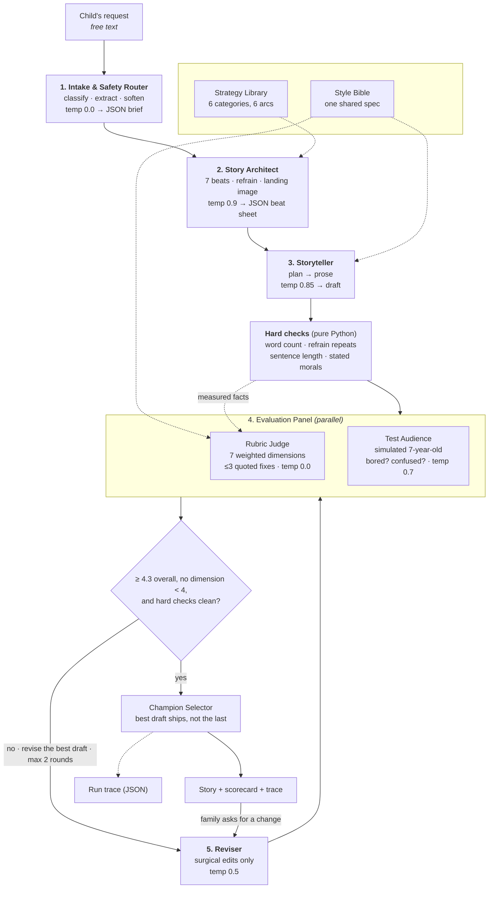

# Architecture

For a walk through the code itself (reading order, one request traced through
the function names, where the tuning knobs live) see [`code_map.md`](code_map.md).

The block diagram is `block_diagram.svg` (open it in any browser). The same
graph in Mermaid, plus the reasoning behind each stage, is below.

## Why each piece exists

**Intake & Safety Router (temp 0.0).** Raw requests are vague ("something with
dragons") or unsuitable ("a story where the monster eats everyone"). This stage
turns either into a structured brief, picks one of six generation strategies,
and softens rather than refuses — a refusal at bedtime is a failure of the
product. It records what it changed so the parent can see it.

**Strategy Library.** A giggly story and a lullaby need different *shapes*, not
the same shape with a different adjective. Each of the six categories carries
its own seven-beat arc, tone note, target length and a category-specific rule
(the funny arc escalates in threes; the spooky arc requires the frightening
thing to turn out lonely by beat 4).

**Story Architect (temp 0.9).** gpt-3.5-turbo writes much better prose when it
isn't also inventing structure mid-sentence. Planning first is the single
biggest quality lever in the pipeline. It also produces the refrain — the
chantable line that makes a story feel read-aloud rather than read.

**Storyteller (temp 0.85).** The only prose call. It gets the beat sheet plus
the style bible and nothing else to decide.

**Hard checks (no model).** These catch defects, not deviations from a word
count. Length is reported across a wide band and only blocks when a draft is
malformed — see the note in `checks.py` about what happened when it was a strict
gate.

 Before the panel runs, Python measures the things
that are countable: word count against target, how many times the refrain
actually appears, sentences over 28 words, and a regex for the stated-moral
phrases 3.5 likes to glue onto endings. Two reasons this is its own stage.
First, an earlier version asked the judge to count and it was wrong most of the
time, confidently reporting three refrains in a draft that used two. Second,
these results are certain, so they get prepended to the fix list and they hold
the gate shut on their own, without needing anyone's opinion. The model is left
to judge only what needs taste.

**Evaluation Panel (run in parallel).** Two evaluators, because they fail
differently:

- The **Rubric Judge** grades seven dimensions with explicit 1/3/5 anchors and
  an anti-inflation instruction. It must quote the exact phrase each fix refers
  to, and it is forbidden from rewriting — a judge that rewrites stops being a
  judge and the loop collapses into a second author.
- The **Test Audience** is a simulated seven-year-old who says whether she got
  bored, got confused, got scared, and whether the ending made her sleepy. A
  rubric will happily give 4/5 to a story no child would sit through. This
  catches that.

**Scoring.** The weighted mean is computed in Python, not by the model. Age fit
and the bedtime landing carry the most weight (0.20 each) because they are the
two ways a bedtime story actually fails: a child who can't follow it, or a child
who is wide awake at the end.

**Reviser (temp 0.5).** Runs against the best draft so far, not the most recent
one. That distinction matters: without it, one bad revision poisons every round
that follows. Given the fixes, the listener's reaction and an explicit
"do not disturb" list of what already works. It is told to make the smallest set
of changes, not to start over. Revision is invention under constraint, so the
temperature sits between the judge's 0.0 and the writer's 0.85.

**Champion Selector.** Revision can make things worse — a fix for one dimension
can flatten another. Every draft is kept and scored, and the highest scorer
ships, not whichever one came last.

**User feedback.** After the story is read, the family can ask for a change.
That note re-enters at the Reviser with explicit priority over the judge's
notes, and the result is graded like any other draft.

## Failure handling

| Failure | Behaviour |
|---|---|
| Malformed JSON | strip fences → brace-match extract → one repair call → then raise |
| Transient API error | 4 attempts, exponential backoff with jitter |
| `response_format` unsupported | detected once, JSON mode disabled, call retried |
| Architect returns ≠7 beats | padded from the arc template, run continues |
| Test Audience call fails | treated as "no complaints"; the panel is advisory |
| Revision scores lower | earlier draft ships, and the next round revises from it |
| Judge miscounts | it is never asked to count; measurements come from Python |
